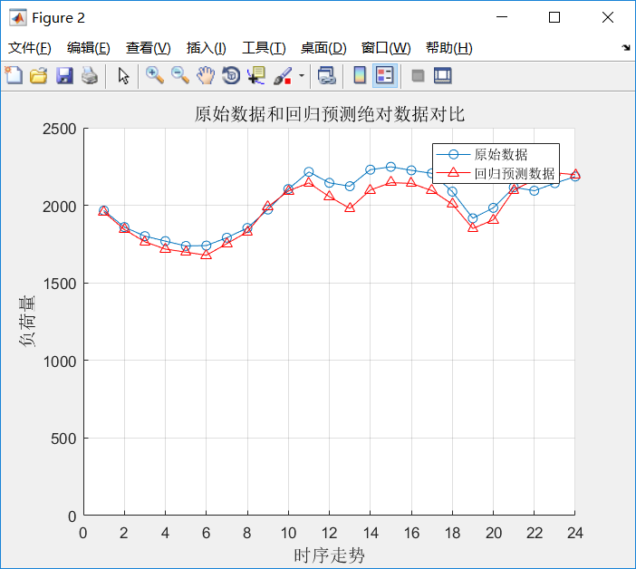

<!-- I'm Passionate about the FUTURE., despite the detours. -->

## Education

- **Ph.D. Candidate, Tsinghua University**
  - Electrical Engineering, [Department of Electrial Engineering](https://www.eea.tsinghua.edu.cn/en/){:target="_blank"}
  - 2020.09 - Present
  - Beijing, China
- **B.E., Southeast University**
  - Electrical Engineering, [School of Electrial Engineering](https://ee.seu.edu.cn/eeen/main.psp){:target="_blank"}
  - GPA: 3.89/4.0, **Ranking：Top 1%**
  - 2016.09 - 2020.06
  - Nanjing, China

## Awards

- 2020, **Graduation with Honor: College Graduate Excellence Award** (Top 5%)
- 2018, **National Scholarship for Undergraduate Students** (Top 5%)
- 2018, **Excellent Student of Jiangsu Province** (Top 1%)
- 2017, **President Scholarship** (Top 1%)

## Projects

- 2018, **RoboMaster of National Robotics Competition**, National Third Prize
  - Responsible for robot motion control system in **[RoboMaster](https://www.robomaster.com/en-US){:target="_blank"} 2018**.
  - Embedded Development & Machine Learning Algorithm

|   |  |
| :----------------------------------------: | :---------------------------------------: |
|             RoboMaster Moment              |             RoboMaster Moment             |
| ------------------------------------------ |           ---------------------           |

- 2018, **Terminal and Data based Smart Grid Technology**, Score A
  - Student Research Training Program (SRTP)
  - Design of load forecasting algorithm

<!-- |  |  |
| :----------------------------------------------------------------: | :-------------------------------------------------: |
|              Results of Short-Term Load Forecasting 1              |      Results of Short-Term Load Forecasting 2       |
|             -----------------------------------------              |                ---------------------                | -->

## Skills

- **Data Analysis**
  - Master scientific calculation tools, such as **Python** and **MATLAB**
  - Data Structures and Algorithms(my **[LeetCode](https://leetcode-cn.com/u/qizhenkang/){:target="_blank"}**)
  - Self-study Courses:
    - Convex Optimization
    - Introduction to Artificial Intelligence
    - Deep Learning
- **Simulation Software**
  - Master **PSCAD**
- **English**
  - College English Test - Band 6 (CET-6), 530
  - IELTS (Currently preparing)
  - Master English reading/writing skills
  - Master literature search and management methods

## Contact

- E-mail: [qizhenkang@foxmail.com](mailto:qizhenkang@foxmail.com)
- Linkedin: [Zhenkang Qi](https://www.linkedin.com/in/qizhenkang/){:target="_blank"}
  <!-- - WeChat: sdlwqzk -->
  <!-- - Phone: +86-18801380634 -->
