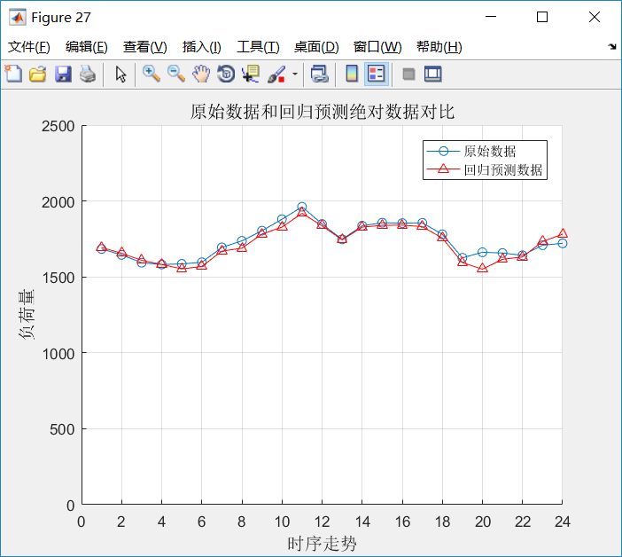

<!--  -->

## 教育经历

- **清华大学** 电机工程与应用电子技术系 **博士研究生**
  - 电力系统及其自动化
  - 免试直博生
  - 2020.09 - 至今
- **东南大学** 电气工程学院 **学士学位**
  - 电气工程及其自动化
  - GPA: 3.89/4.0 排名：1/161
  - 2016.09 - 2020.06

## 荣誉奖励

- 2020 届 东南大学**本科优秀毕业生** (前 5%)
- 2017-2018 学年 **国家奖学金** (前 5%)
- 2018-2019 学年 **省级三好学生** (前 1%)
- 2016-2017 学年 **校长奖学金** (前 1%)

## 项目经历

- 全国大学生机器人大赛 RoboMaster 总决赛 全国三等奖
  - 备赛一年，负责"步兵"机器人的运动控制系统
  - 嵌入式开发 & 机器学习算法

|   |  |
| :----------------------------------------: | :---------------------------------------: |
|            RoboMaster Moment 1             |            RoboMaster Moment 2            |
| ------------------------------------------ |           ---------------------           |

- 智能电网应用技术研究 校级优秀结题
  - 数据驱动的负荷预测算法

<!-- |  |  |
| :-------------------------------------------------: | :-------------------------------------------------: |
|      Results of Short-Term Load Forecasting 1       |      Results of Short-Term Load Forecasting 2       |
|      -----------------------------------------      |                ---------------------                | -->

## 技能水平

- **数据分析**
  - 熟练掌握*Python*、*MATLAB*等科学计算工具
  - 算法方面：自学凸优化、人工智能导论、深度学习等课程
- **电力仿真工具**
  - *PSCAD*等电力仿真软件
- **英语水平**
  - 大学英语六级（_530_）
  - IELTS（正在准备中…）
  - 良好的英文阅读/写作能力
  - 掌握英文文献搜索与管理方法

## 与我取得联系：

- E-mail: [qizhenkang@foxmail.com](mailto:qizhenkang@foxmail.com)
- Linkedin: [Zhenkang Qi](https://www.linkedin.com/in/qizhenkang/)
- WeChat: sdlwqzk
<!-- - Phone: +86-18801380634 -->
